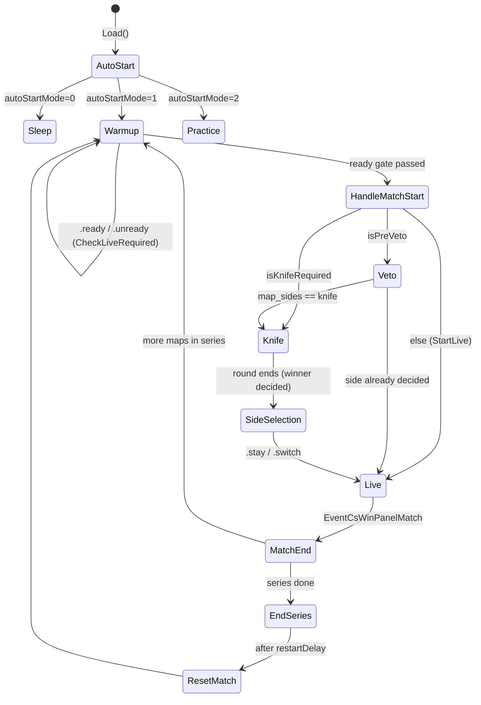

# 03 — Match Lifecycle & State Machine

How a server moves through phases, who flips which flags, and which `.cfg` runs when. Primary sources:
[`Utility.cs`](../Utility.cs), [`MatchManagement.cs`](../MatchManagement.cs), [`ReadySystem.cs`](../ReadySystem.cs),
[`SleepMode.cs`](../SleepMode.cs), and the knife/round-end hooks in [`MatchZy.cs`](../MatchZy.cs).

> Recall: there is **no formal FSM**. "Phase" = the current combination of the flags catalogued in
> [01-architecture.md](01-architecture.md#state-flags). The functions below are the *only* legitimate way those flags
> should change; if you add flow code, route it through them and keep flags consistent.

---

## 1. The four operating modes

A server is always in one of these (driven by the flags + which cfg is active):

| Mode | How entered | Key flags | Notes |
|---|---|---|---|
| **Pug** (default) | `autoStartMode=1`, no match config loaded | `readyAvailable`, `isWarmup` | Teams not locked; `.ready` gate uses `minimumReadyRequired`. 1 map, auto-reset on end. |
| **Match** | `matchzy_loadmatch[_url]` loads a config | `isMatchSetup` (+ `matchModeOnly` to lock roster) | Players locked to teams/sides; BO1/3/5; veto; series tracking. |
| **Practice** | `.prac`/`.tactics` or `autoStartMode=2` | `isPractice` | Cheats, bots, nade tools. See [05-practice-mode.md](05-practice-mode.md). |
| **Scrim / Playout** | `.playout` toggles `isPlayOutEnabled` | `isPlayOutEnabled` | All rounds played (no clinch, no OT) — applied by `HandlePlayoutConfig()`. |
| **Sleep** | `autoStartMode=0` or `.sleep`/`css_sleep` | `isSleep` | Idle; execs `sleep.cfg` (or `gamemode_competitive.cfg`). Cannot enter once `matchStarted`. |

---

## 2. Phase flow (happy path for a match)

### Step-by-step (with the functions that do it)

1. **`Load()` → `AutoStart()`** ([`Utility.cs:1751`](../Utility.cs)) branches on `autoStartMode`
   (ConVar `matchzy_autostart_mode`, default 1):
   - `0` → `StartSleepMode()`
   - `1` → `readyAvailable=true; isPractice=false; StartWarmup()`
   - `2` → `StartPracticeMode()`

2. **Warmup** — `StartWarmup()` ([`Utility.cs:230`](../Utility.cs)): sets `isWarmup=true`, runs `ExecWarmupCfg()`
   (execs `MatchZy/warmup.cfg`, or a hardcoded fallback string if the file is missing), and starts a **repeating
   "unready players" chat timer** (`unreadyPlayerMessageTimer`, every `chatTimerDelay`≈13s) via
   `SendUnreadyPlayersMessage()`.

3. **Ready gate** — players run `.ready` (→ `OnPlayerReady`), which ultimately calls **`CheckLiveRequired()`**
   ([`Utility.cs:683`](../Utility.cs)). It early-returns unless `readyAvailable && !matchStarted`, then decides
   `liveRequired`:
   - **Match mode** (`isMatchSetup`): `IsTeamsReady() && IsSpectatorsReady()` (per-team min players/ready from the
     match config — see [`ReadySystem.cs`](../ReadySystem.cs)).
   - **Pug, `minimumReadyRequired==0`**: every connected player is ready (`countOfReadyPlayers >= connectedPlayers`).
   - **Pug, otherwise**: `countOfReadyPlayers >= minimumReadyRequired`.
   - If true → **`HandleMatchStart()`**.
   `.forceready` (`OnForceReadyCommandCommand` in [`ReadySystem.cs`](../ReadySystem.cs)) force-readies a whole team in
   match mode (if `allowForceReady`) and also calls `CheckLiveRequired()`.

4. **`HandleMatchStart()`** ([`Utility.cs:714`](../Utility.cs)):
   - `isPractice=false; isDryRun=false`.
   - If `isRoundRestorePending` → `RestoreRoundBackup(...)` and **return** (restore flow, not a fresh start).
   - Assign default team names from a player on each side if still `COUNTER-TERRORISTS`/`TERRORISTS`.
   - `liveMatchId = database.InitMatch(...)` → creates the DB match row; `SetupRoundBackupFile()`; `GetSpawns()`.
   - **Branch:**
     - `isPreVeto` → **`CreateVeto()`** (veto runs first; see [06-map-veto.md](06-map-veto.md)).
     - else `isKnifeRequired` → **`StartKnifeRound()`**.
     - else → `StartDemoRecording(); StartLive()`.
   - Optionally prints the "MatchZy Plugin by WD-" credit (`matchzy_show_credits_on_match_start`) and the
     `matchzy_match_start_message` (split on `$$$`, color-treated).

5. **Knife** — `StartKnifeRound()` ([`Utility.cs:239`](../Utility.cs)): `matchStarted=true; isKnifeRound=true;
   readyAvailable=false; isWarmup=false`; execs `MatchZy/knife.cfg` (+ `mp_restartgame 1; mp_warmup_end`), or a
   hardcoded knife fallback; prints "KNIFE!".

6. **Knife end** — handled in the **`EventRoundEnd` (Pre)** lambda in [`MatchZy.cs`](../MatchZy.cs) (~line 268):
   `DetermineKnifeWinner()` sets `knifeWinner` (3=CT, 2=T); the handler rewrites `@event.Winner`/`Reason`, sets
   `isSideSelectionPhase=true; isKnifeRound=false`, and calls **`StartAfterKnifeWarmup()`**
   ([`Utility.cs:280`](../Utility.cs)) which re-enters warmup, computes `knifeWinnerName`, shows the damage report,
   and starts a repeating "type `.stay`/`.switch`" prompt.
   - Knife winner logic: team with **more alive players** wins; tie → **more total HP**; still tie → **random**
     (see `GetAlivePlayers()` [`Utility.cs:353`](../Utility.cs) and `DetermineKnifeWinner` in `Coach.cs`/`Utility.cs`).

7. **Side selection** — the knife-winning side runs `.stay`/`.switch`/`.ct`/`.t` (handlers in [`Teams.cs`](../Teams.cs)).
   That path calls **`StartLive()`** (after `SwapSidesInTeamData` if switching).

8. **Live** — `StartLive()` ([`Utility.cs:315`](../Utility.cs)) → `SetupLiveFlagsAndCfg()`:
   - `SetLiveFlags()`: `isWarmup=false; isSideSelectionPhase=false; matchStarted=true; isMatchLive=true;
     readyAvailable=false; isKnifeRound=false`.
   - `KillPhaseTimers()`, `ExecLiveCFG()` (live.cfg or live_wingman.cfg by game mode; hardcoded fallback otherwise),
     then after 1s `HandlePlayoutConfig()` + `ExecuteChangedConvars()`.
   - `StartDemoRecording()`, seed `round00` backup filenames, `mp_match_end_restart true`, print "LIVE!", fire
     `GoingLiveEvent` to the remote log.

9. **Match (map) end** — `EventCsWinPanelMatch` → `HandleMatchEnd()` ([`Utility.cs:840`](../Utility.cs)):
   - Extends `mp_match_restart_delay` so the **GOTV broadcast can flush** before restart (delay = `tv_delay + 15`,
     +10 more if `tv_delay>0`).
   - `StopDemoRecording(...)`; computes winner + scores; fires `MapResultEvent`; writes DB map-end data and the
     **player-stats CSV** (`csgo/MatchZy_Stats/<matchid>/...`).
   - **Pug** (`!isMatchSetup`) → `EndSeries(...)` (treated as a 1-map series; BO3/BO5 pugs are a TODO).
   - **Match/series**: compute `remainingMaps`; end the series on tie-with-no-maps-left, on clinch
     (`SeriesCanClinch` and a team reached `NumMaps/2+1`), or when `remainingMaps<=0`; otherwise advance
     `CurrentMapNumber`, `ChangeMap(nextMap)`, reset to warmup, `StartWarmup()`, `SetMapSides()`.

10. **`EndSeries()`** ([`MatchManagement.cs:578`](../MatchManagement.cs)): announce winner/draw, fire
    `MatchZySeriesResultEvent`, `database.SetMatchEndData(...)`, reset cvars if `resetCvarsOnSeriesEnd`,
    `isMatchLive=false`, then after `restartDelay` → `ResetMatch(false)`.

11. **`ResetMatch(bool warmupCfgRequired=true)`** ([`Utility.cs:372`](../Utility.cs)): stops demo if recording,
    resets *all* phase flags back to the warmup/ready baseline (`matchStarted=false; readyAvailable=true;
    isWarmup=true; isMatchSetup=false; liveMatchId=-1; …`), unreadies all players, clears ready-overrides, unpause
    data, stop data, and clan tags. This is the "back to clean warmup" reset.

---

## 3. CFG execution model (important)

Each phase **executes a `.cfg` file** via `Server.ExecuteCommand("exec MatchZy/<phase>.cfg")`. The canonical paths
are constants in [`Utility.cs`](../Utility.cs):

| Constant | Path | Used by |
|---|---|---|
| `warmupCfgPath` | `MatchZy/warmup.cfg` | `ExecWarmupCfg()` |
| `knifeCfgPath` | `MatchZy/knife.cfg` | `StartKnifeRound()` |
| `liveCfgPath` | `MatchZy/live.cfg` | `ExecLiveCFG()` (5v5) |
| `liveWingmanCfgPath` | `MatchZy/live_wingman.cfg` | `ExecLiveCFG()` (wingman) |
| `sleepCfgPath` | `MatchZy/sleep.cfg` | `StartSleepMode()` |

**Robustness pattern:** every `Exec*Cfg` checks `File.Exists(...)`; if the cfg is missing it falls back to a giant
**hardcoded ConVar string** baked into the C#. So the plugin still runs competitive settings even without the cfg
files — but the cfg files (and their `*_override.cfg` siblings) are the intended customization surface. The live
fallback strings in `ExecLiveCFG()` ([`Utility.cs:1307`](../Utility.cs)) are the de-facto spec of "competitive
defaults" for 5v5 and wingman.

> Practice/dryrun use their own configs (`prac.cfg`, `dryrun.cfg`) — covered in
> [05-practice-mode.md](05-practice-mode.md). Phase config files themselves are catalogued in
> [11-utility-localization-configs.md](11-utility-localization-configs.md).

---

## 4. Game mode (5v5 vs Wingman)

- `GetGameMode()` reads the `game_mode` ConVar: **1 = competitive 5v5**, **2 = wingman 2v2** (`game_type` 0 = classic).
- `SetCorrectGameMode()` sets `game_mode = Wingman ? 2 : 1`, `game_type = 0`.
- `IsMapReloadRequiredForGameMode(wingman)` returns true if the current mode/type doesn't match what the match needs
  — a map reload is required to actually switch game mode, so loading a wingman match on a 5v5 server triggers a map
  change. The match config's `wingman` boolean drives this (see [07-match-management-and-get5.md](07-match-management-and-get5.md)).
- `HandlePlayoutConfig()`: if `isPlayOutEnabled` → `mp_overtime_enable 0; mp_match_can_clinch false`; else it reads
  the values back from the active live cfg file.

---

## 5. Sleep mode

`StartSleepMode()` ([`SleepMode.cs`](../SleepMode.cs)): refuses if `matchStarted`; sets `isSleep=true` and clears all
other phase flags; execs `MatchZy/sleep.cfg` if present, else `ExecUnpracCommands()` + `gamemode_competitive.cfg`.
Entered automatically when `autoStartMode==0`, or manually via `css_sleep` (admin: `@css/map` or `@custom/prac`).
This is the "server is idle / nobody's playing" resting state.

---

## 6. Mode-switch entry points

- **Into practice:** `.prac`/`.tactics` → `StartPracticeMode()` (see [05](05-practice-mode.md)).
- **Out of practice into match mode:** `.match`/`.exitprac` → `StartMatchMode()` ([`Utility.cs:1298`](../Utility.cs)):
  guards `matchStarted || (!isPractice && !isSleep)`, runs `ExecUnpracCommands()`, `ResetMatch()`,
  `RemoveSpawnBeams()`, prints "Match mode loaded!".
- **Force start:** `.start`/`.forcestart` → `OnStartCommand` (bypasses the ready gate).
- **Restart/end:** `.restart`/`.rr`, `.endmatch`/`.forceend` → reset to warmup.

---

## 7. Cheat-sheet: who sets the big flags

| Transition fn | Sets true | Sets false |
|---|---|---|
| `StartWarmup` | `isWarmup` | — |
| `StartKnifeRound` | `matchStarted, isKnifeRound` | `readyAvailable, isWarmup` |
| `StartAfterKnifeWarmup` | `isWarmup` (+ `isSideSelectionPhase` set by caller) | — |
| `SetLiveFlags` (via `StartLive`) | `matchStarted, isMatchLive` | `isWarmup, isSideSelectionPhase, readyAvailable, isKnifeRound` |
| `EndSeries` | — | `isMatchLive` |
| `ResetMatch` | `readyAvailable, isWarmup` | `matchStarted, isMatchSetup, isMatchLive, isKnifeRound, isSideSelectionPhase, isPractice, isDryRun, isVeto, isPreVeto, isPaused` |
| `StartSleepMode` | `isSleep` | `isPractice, isDryRun, isWarmup, readyAvailable, matchStarted, isSideSelectionPhase, isMatchLive` |

> ⚠️ The single most common way to break match flow is to set one of these flags directly instead of going through
> the transition functions, leaving the set inconsistent (e.g. `isMatchLive=true` while `isWarmup=true`). Always
> transition through the functions above.
